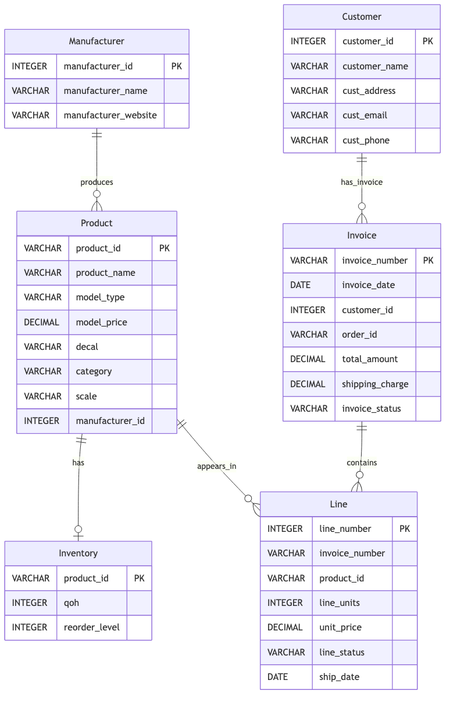

# RC Model — Diagram & Business Rules

This document explains the RC Model (ModelShop) ER diagram, the entities, their important attributes, relationships, and the business rules captured by the model.

## Overview
- Purpose: represent orders (invoices), order lines, shipments (partial deliveries), product catalog and inventory for a model shop.
- Diagram file: `RC_model.mmd` (Mermaid ER) and rendered image `RC_model.png` in the repository root.

## Entities & key attributes

- Customer
  - `customer_id` (PK) — unique customer identifier
  - `cust_name`, `cust_email`, `cust_phone`, `cust_address`
  - Notes: primary buyer, referenced by invoices.

- Manufacturer
  - `manufacturer_id` (PK) — unique maker of products
  - `manufacturer_name`, `manufacturer_website`
  - Notes: producers of models/decals; used for product provenance and filtering.

- Product
  - `product_id` (PK)
  - `manufacturer_id` (FK) — references `Manufacturer`
  - `product_name`, `model_type` (e.g., Car, Aircraft, Ship, Decal), `model_price`, `min_order_qty`, `scale`
  - Notes: master data for items sold; `model_price` is current price, `min_order_qty` used for purchasing rules.

- Inventory
  - `product_id` (PK, FK) — one inventory row per product
  - `qoh` (quantity on hand), `reorder_level`
  - Notes: tracks stock; reorder triggers when `qoh <= reorder_level`.

- Invoice
  - `invoice_number` (PK)
  - `customer_id` (FK) — references `Customer`
  - `invoice_date`, `total_amount`, `shipping_charge`, `invoice_status` (Open, Partially Shipped, Closed)
  - Notes: acts as the order header in this model (no separate order table).

- Line
  - Composite PK: (`invoice_number`, `line_number`)
  - `product_id` (FK) — references `Product`
  - `line_units`, `unit_price` (snapshotted when ordered), `line_status` (Backordered, Partial, Fulfilled), `ship_date`
  - Notes: each invoice must have at least one line; `unit_price` is stored to preserve historical pricing.

- Shipment
  - `shipment_id` (PK)
  - `invoice_number` (FK) and `line_number` (FK) — references `Line` (composite)
  - `qty_shipped`, `ship_date`, `tracking_number`, `shipment_status` (Created, Shipped, Delivered)
  - Notes: supports partial shipments for a line (multiple shipments may fulfill a line over time).

## Relationships (summary)
- Customer 1 — 0..N Invoice (Customer generates invoices)
- Invoice 1 — 1..N Line (Invoice must have at least one Line)
- Manufacturer 1 — 0..N Product (Manufacturer produces many Products)
- Product 1 — 1 Inventory (one-to-one stock record per product)
- Product 1 — 0..N Line (Products appear on many order lines)
- Invoice 1 — 0..N Shipment (Invoice may have many shipments)
- Line 1 — 0..N Shipment (Line may be partially shipped across multiple shipments)

Relationship labels in the Mermaid diagram include FK column names so you can see which attributes implement the link (for example `customer_id (FK)`, `manufacturer_id (FK)`, and the composite `invoice_number,line_number (FKs)` used in shipments).

## Business rules (enforced conceptually by ER design)
1. Invoice acts as the order header — there is no separate Order table. Each Invoice must reference a Customer.
2. Each Invoice must have at least one Line. Lines are uniquely identified within an invoice by `line_number` (composite PK with `invoice_number`).
3. A Product must have an Inventory row (one-to-one) so stock is tracked for every sold product.
4. Shipments are linked to specific Line items and may be partial. The `qty_shipped` across shipments for a single Line must not exceed the Line's `line_units`.
5. `unit_price` is stored on the Line to snapshot the sale price at order time (product price can change later).
6. `model_price` on Product must be non-negative. `line_units`, `qty_shipped`, and `min_order_qty` must be positive integers.
7. `ship_date` on Shipment must be on or after the corresponding `invoice_date` (business constraint — enforceable in application or DB triggers).

## SQL mapping
- A `RC_model.sql` file is included in the repo that contains CREATE TABLE statements, PKs, composite PK for `Line`, and FK constraints matching this ER model.

## How to view the diagram
1. Open `rc_erd_viewer.html` in your browser (double-click or run `open rc_erd_viewer.html`) — it loads `RC_model.mmd` and renders the diagram using Mermaid.
2. Open `RC_model.png` for a static rendered image.

## Next steps / suggestions
- Add DB-level constraints (CHECKs, triggers) if you want the database to enforce domain rules like phone format, non-negative amounts, and `qty_shipped` totals.
- Export DDL to your target RDBMS and run migrations to create the schema.
- If you'd like, I can produce a per-table sample INSERT dataset (useful for testing) or update the Mermaid layout to a custom arrangement.

---
Generated from `RC_model.erd` on the repository root. If you want edits to attribute names, data types, or to add additional business rules in the doc, tell me which change and I'll update both the `.erd` and this document and re-render the diagram.
